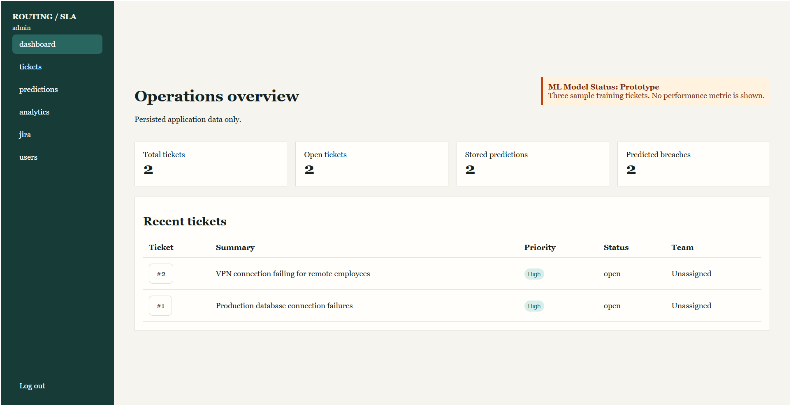
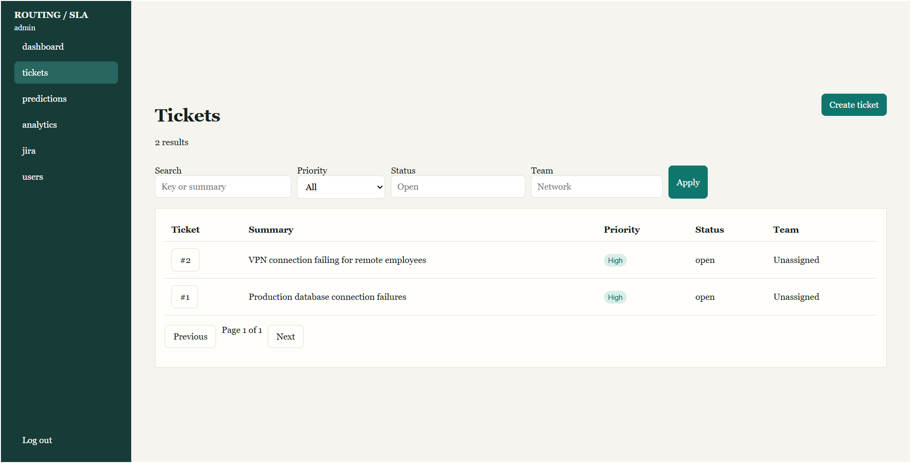
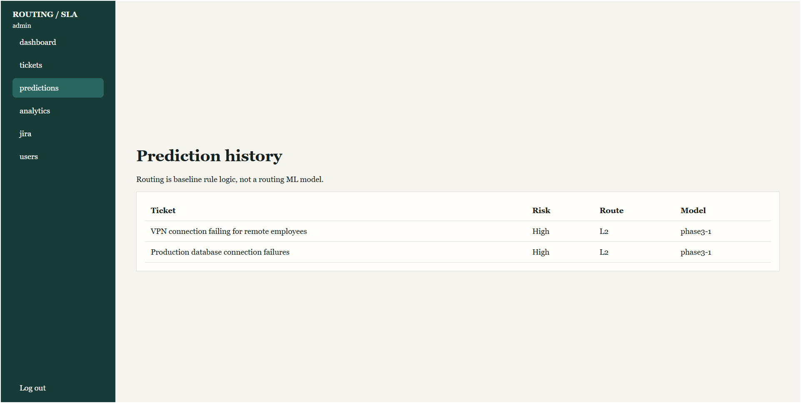
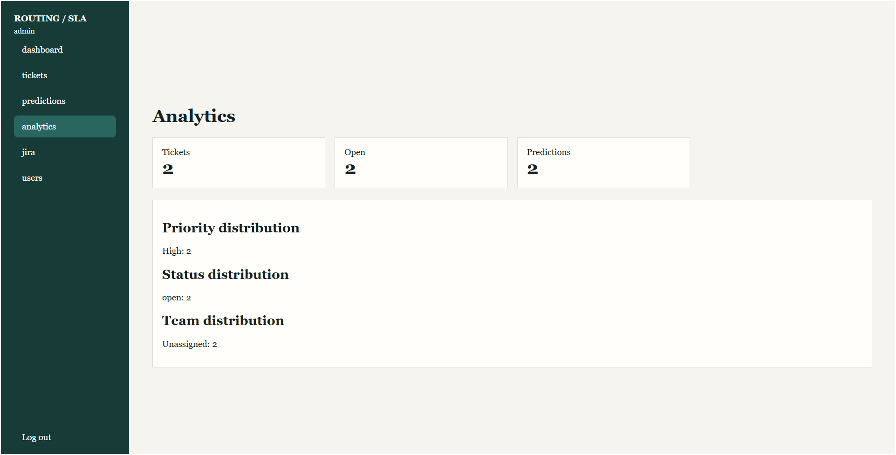

<div align="center">

# 🎫 AI-Powered Ticket Routing & SLA Breach Prediction

<p align="center">
  
</p>

<p align="center">


</p>

<p align="center">


</p>

---

### 🚀 Intelligent Ticket Routing with Machine Learning

A practical support-ticket platform that uses machine learning to predict SLA breach risk and combines that prediction with a transparent baseline team recommendation. The project includes a Flask REST API and a web-based operations dashboard.

</div>

---

# 🚀 Live Demo — Recruiter Access

### 🌐 Try the Deployed Application

**🔗 Live Demo:** https://ai-powered-ticket-routing-system.onrender.com/

> ### 🔐 Demo Credentials
> **Demo ID:** `Demo@gmail.com`  
> **Password:** `Demo@1234`
>
> Use the dedicated demo account to explore the deployed ticket-management, automatic prediction, prediction-history, and analytics workflows.

## 🖥️ Product UI Showcase

### 📊 Operations Dashboard



### 🎫 Ticket Management



### 🤖 SLA Prediction History



### 📈 Analytics Dashboard



---

# 📌 Table of Contents

- [Live Demo](#-live-demo--recruiter-access)
- [UI Showcase](#-product-ui-showcase)
- [Overview](#-overview)
- [Features](#-features)
- [Tech Stack](#-tech-stack)
- [Project Architecture](#-project-architecture)
- [Project Structure](#-project-structure)
- [Installation](#️-installation)
- [Running the Application](#️-run-the-application)
- [REST API](#-rest-api)
- [Machine Learning Workflow](#-machine-learning-workflow)
- [Running Tests](#-running-tests)
- [Data and Model Limitations](#-data-and-model-limitations)
- [Future Improvements](#-future-improvements)
- [License](#-license)

---

# 📖 Overview

Managing support tickets efficiently is critical for reducing response times and maintaining Service Level Agreements (SLAs).

This project demonstrates how machine learning can assist support teams by predicting whether a ticket is likely to breach its SLA and providing a transparent routing recommendation.

The application combines a Flask REST API with a lightweight web frontend for creating tickets, reviewing predictions, and viewing operational analytics.

---

# ✨ Features

- ✅ SLA breach-risk prediction
- ✅ Intelligent baseline ticket routing
- ✅ Automatic prediction after ticket creation
- ✅ Prediction history
- ✅ Ticket management dashboard
- ✅ Analytics dashboard
- ✅ REST API using Flask
- ✅ Random Forest machine learning model
- ✅ Automatic model training
- ✅ Authentication and role-based access control
- ✅ Health and readiness endpoints
- ✅ Automated testing with Pytest
- ✅ Docker-based deployment
- ✅ Render deployment

---

# 🛠️ Tech Stack

| Category | Technology |
|---|---|
| Language | Python |
| Backend | Flask |
| Machine Learning | Scikit-Learn |
| Data Processing | Pandas |
| Model Storage | Joblib |
| Frontend | HTML, CSS, JavaScript |
| Testing | Pytest |
| Deployment | Docker, Render |

---

# 🧠 Project Architecture

```text
                    Ticket Data
                         |
                         v
                Data Preprocessing
                         |
                         v
                Feature Selection
                         |
                         v
               Random Forest Model
                         |
                         v
                  SLA Prediction
                         |
          +--------------+--------------+
          |                             |
          v                             v
   Risk Prediction             Routing Recommendation
          |                             |
          +--------------+--------------+
                         |
                         v
                  Flask REST API
                         |
                         v
                 Web Dashboard
```

---

# 📂 Project Structure

```text
AI-Powered-Ticket-Routing-System
|
├── api/
├── data/
|   └── tickets.csv
|
├── docs/
|   ├── screenshots/
|   |   ├── dashboard.png
|   |   ├── tickets.png
|   |   ├── predictions.png
|   |   └── analytics.png
|   ├── architecture.md
|   ├── dataset_contract.md
|   ├── dataset_profile.md
|   ├── ml_data_audit.md
|   ├── platform.md
|   ├── product.md
|   └── security.md
|
├── frontend/
├── ml_model/
├── src/
├── tests/
├── app.py
├── Dockerfile
├── render.yaml
├── requirements.txt
├── requirements-dev.txt
└── README.md
```

---

# ⚙️ Installation

## Clone Repository

```bash
git clone https://github.com/Ganeshbasani/AI-Powered-Ticket-Routing-System.git
cd AI-Powered-Ticket-Routing-System
```

## Create Virtual Environment

### Windows

```bash
python -m venv venv
venv\Scriptsctivate
```

### Linux / macOS

```bash
python3 -m venv venv
source venv/bin/activate
```

## Install Dependencies

```bash
pip install -r requirements.txt
```

For development and testing:

```bash
pip install -r requirements-dev.txt
```

---

# ▶️ Running the Application

```bash
python app.py
```

Local server:

```text
http://127.0.0.1:5000
```

---

# 🌐 REST API

The application exposes a Flask REST API under `/api/v1`.

## Authentication

```http
POST /api/v1/auth/login
```

Authentication returns an expiring bearer token used for protected endpoints.

## Ticket Endpoints

| Method | Endpoint | Purpose |
|---|---|---|
| `POST` | `/api/v1/tickets` | Create a ticket |
| `GET` | `/api/v1/tickets` | List tickets |
| `GET` | `/api/v1/tickets/<id>` | Get a ticket |
| `PATCH` | `/api/v1/tickets/<id>` | Update a ticket |
| `POST` | `/api/v1/tickets/<id>/predict` | Generate a prediction |
| `GET` | `/api/v1/tickets/<id>/predictions` | View prediction history |

## Prediction

```http
POST /api/v1/predict
```

### Request

```json
{
  "priority": "High",
  "created_hours": 8
}
```

### Response

```json
{
  "assigned_team": "L2",
  "sla_breach_risk": "High"
}
```

The response also includes the model version and request ID. The API intentionally does not expose an uncalibrated probability.

## System Endpoints

| Method | Endpoint | Purpose |
|---|---|---|
| `GET` | `/api/v1/health` | Process health check |
| `GET` | `/api/v1/ready` | Model/readiness check |

---

# 🔐 Security and Administration

The API uses expiring bearer tokens and role-based access control.

| Role | Access |
|---|---|
| Admin | User administration, ticket management, full protected access |
| Support Agent | Create and update tickets, request predictions |
| Analyst | Read-only ticket and prediction access |

The application also includes:

- Request IDs for traceability
- Audit logging for important actions
- Configurable rate limits
- Request-size limits
- Disabled-account protection
- Consistent validation and error responses

See [Security and Operations](docs/security.md) for the complete security details.

---

# ⚙️ Configuration

Copy `.env.example` to `.env` for local configuration.

| Variable | Purpose |
|---|---|
| `APP_ENV` | Application environment |
| `FLASK_PORT` | Local Flask port |
| `FLASK_DEBUG` | Development debug mode |
| `LOG_LEVEL` | Application log level |
| `MODEL_PATH` | Model artifact location |
| `DATA_PATH` | Ticket data location |
| `BOOTSTRAP_ADMIN_EMAIL` | Initial administrator email |
| `BOOTSTRAP_ADMIN_PASSWORD` | Initial administrator password |

The application validates configuration at startup and keeps model/data paths inside the application directory.

---

# 🤖 Machine Learning Workflow

```text
Load Ticket Data
       |
       v
Validate and Prepare Data
       |
       v
Select Prediction Features
       |
       v
Train Random Forest
       |
       v
Save Model Artifact
       |
       v
Load Model
       |
       v
Prediction API
       |
       v
SLA Risk + Routing Recommendation
```

### Prediction Features

The current prediction pipeline uses:

| Feature | Description |
|---|---|
| `priority` | Ticket priority |
| `created_hours` | Approximate ticket age in hours |

The model does not use `ticket_id`, `assigned_team`, or the target `sla_breach` field as prediction features.

---

# 🐳 Docker and Deployment

## Build

```bash
docker build -t sla-ticket-routing .
```

## Run

```bash
docker run --rm -p 10000:10000 --env-file .env sla-ticket-routing
```

The production container uses a non-root user and is configured for deployment on Render.

**Live deployment:** https://ai-powered-ticket-routing-system.onrender.com/

---

# 🧪 Testing

Run the complete test suite:

```bash
python -m pytest -q
```

The verified development test suite passes:

```text
42 passed
```

The project also includes frontend build checks and a GitHub Actions CI workflow.

---

# 📊 Dataset and Model Limitations

The bundled dataset contains only three sample tickets. It is sufficient to exercise the training and prediction workflow, but it is not large enough to support meaningful claims about production model accuracy.

The current model is therefore presented as a working prototype rather than a production-grade predictive system.

See [ML Data Audit](docs/ml_data_audit.md) and [Dataset Contract](docs/dataset_contract.md) for the documented data and evaluation limitations.

---

# 📚 Documentation

| Document | Description |
|---|---|
| [Architecture](docs/architecture.md) | System architecture and components |
| [Product](docs/product.md) | Ticket lifecycle and product workflows |
| [Platform](docs/platform.md) | Platform/API behavior |
| [Security](docs/security.md) | Authentication, roles, audit, and security controls |
| [Dataset Contract](docs/dataset_contract.md) | Data validation and canonicalization |
| [Dataset Profile](docs/dataset_profile.md) | Generated dataset profile |
| [ML Data Audit](docs/ml_data_audit.md) | Target definition, features, leakage checks, and evaluation limits |

---

# 🚀 Future Improvements

- Add a larger representative ticket dataset
- Evaluate the model with robust validation metrics
- Introduce a dedicated routing model
- Integrate a real JIRA provider
- Add browser-level UI tests
- Add shared rate-limit storage for multi-instance deployments
- Improve model monitoring and retraining workflows

---

# 📜 License

This project is licensed under the **MIT License**.

---

<div align="center">

## 👨‍💻 Developer

### **Basani Ganesh**

B.Tech — Computer Science & Engineering

Focused on software development, AI, and machine learning.

**GitHub:**  
https://github.com/Ganeshbasani

</div>
